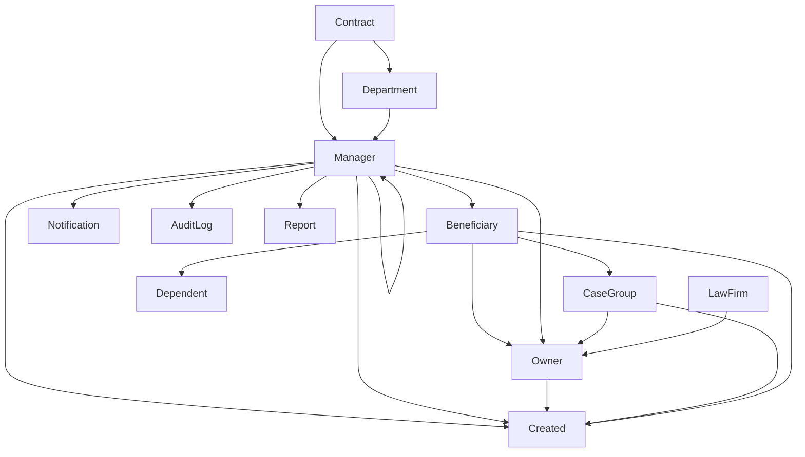

# Data Model Documentation

**AMA-IMPACT Backend Database Schema v3.0**

Complete documentation of all database models, relationships, and data structures used in the Immigration Visa Management System.

## Database Overview

- **Database Engine**: SQLAlchemy with PostgreSQL/SQLite support
- **Migration Tool**: Alembic for version control
- **Total Models**: 12 core models with comprehensive relationships
- **Key Features**: Audit logging, hierarchical access control, automated notifications

## Core Models

### 1. User Model (`users`)

**Purpose**: System user accounts with role-based access control

```python
class User:
    id: int                          # Primary key
    email: str                       # Unique email address (login)
    password_hash: str               # bcrypt hashed password
    first_name: str                  # Given name
    last_name: str                   # Family name
    role: UserRole                   # ADMIN, HR, PM, MANAGER, BENEFICIARY
    is_active: bool                  # Account status
    contract_id: int                 # FK to contracts
    department_id: int               # FK to departments (nullable)
    manager_id: int                  # FK to users (self-referencing)
    created_at: datetime
    updated_at: datetime
```

**Relationships:**
- **Contract**: Many-to-one (users belong to one contract)
- **Department**: Many-to-one (users assigned to department)
- **Manager**: Self-referencing (hierarchical reporting structure)
- **Visa Applications**: One-to-many (users can have multiple visa cases)
- **Todos**: One-to-many (users can be assigned tasks)
- **Notifications**: One-to-many (users receive notifications)

**User Roles & Hierarchy:**
```
ADMIN       → Full system access
├── HR      → Multi-contract access
├── PM      → Contract-wide access
├── MANAGER → Team-level access (hierarchical)
└── BENEFICIARY → Self-only access
```

### 2. Contract Model (`contracts`)

**Purpose**: Organizational structure for project/contract-based access control

```python
class Contract:
    id: int                          # Primary key
    name: str                        # Contract name (e.g., "ASSESS")
    code: str                        # Short code (e.g., "ASSESS")
    description: str                 # Contract description
    start_date: date                 # Contract start
    end_date: date                   # Contract end (nullable)
    is_active: bool                  # Contract status
    created_at: datetime
    updated_at: datetime
```

**Relationships:**
- **Users**: One-to-many (contract has many users)
- **Departments**: One-to-many (contract has many departments)
- **Visa Applications**: One-to-many via users

### 3. Department Model (`departments`)

**Purpose**: Hierarchical organizational units within contracts

```python
class Department:
    id: int                          # Primary key
    name: str                        # Department name
    code: str                        # Department code
    contract_id: int                 # FK to contracts
    parent_id: int                   # FK to departments (self-referencing)
    is_active: bool                  # Department status
    created_at: datetime
    updated_at: datetime
```

**Relationships:**
- **Contract**: Many-to-one (departments belong to one contract)
- **Parent**: Self-referencing (hierarchical structure)
- **Children**: One-to-many (department can have sub-departments)
- **Users**: One-to-many (department has many users)

**Hierarchy Example:**
```
ASSESS Contract
├── Engineering
│   ├── Software Development
│   └── Systems Engineering
├── Management
│   └── Program Management Office
└── Support
    ├── HR
    └── Finance
```

### 4. Beneficiary Model (`beneficiaries`)

**Purpose**: Foreign national employees separate from user accounts

```python
class Beneficiary:
    id: int                          # Primary key
    email: str                       # Unique email
    first_name: str                  # Given name
    last_name: str                   # Family name
    country_of_birth: str            # Birth country
    country_of_citizenship: str      # Citizenship country
    is_user: bool                    # Has system user account
    user_id: int                     # FK to users (nullable)
    created_at: datetime
    updated_at: datetime
```

**Relationships:**
- **User**: One-to-one (beneficiary may have user account)
- **Visa Applications**: One-to-many (beneficiary can have multiple visas)
- **Dependents**: One-to-many (beneficiary can have family members)

### 5. Visa Application Model (`visa_applications`)

**Purpose**: Core visa case tracking and management

```python
class VisaApplication:
    id: int                          # Primary key
    beneficiary_id: int              # FK to beneficiaries
    user_id: int                     # FK to users (case owner)
    case_group_id: int               # FK to case_groups (nullable)
    visa_type: str                   # H1B, L1, O1, TN, EB1A, EB1B, EB2, PERM, OPT, EAD, GREEN_CARD
    current_status: str              # PLANNING, ACTIVE, APPROVED, DENIED, EXPIRED, WITHDRAWN
    priority: str                    # LOW, MEDIUM, HIGH, URGENT
    filing_date: date                # When filed (nullable)
    approval_date: date              # When approved (nullable)
    start_date: date                 # Visa start date
    end_date: date                   # Visa expiration date
    law_firm_id: int                 # FK to law_firms (nullable)
    notes: str                       # Case notes
    created_at: datetime
    updated_at: datetime
```

**Relationships:**
- **Beneficiary**: Many-to-one (visa belongs to one beneficiary)
- **User**: Many-to-one (visa owned by one user)
- **Case Group**: Many-to-one (visa part of immigration pathway)
- **Law Firm**: Many-to-one (visa handled by law firm)
- **Todos**: One-to-many (visa can have multiple tasks)

**Computed Properties:**
- `is_expiring_soon`: Expires within configurable timeframe
- `days_to_expiration`: Days until expiration
- `is_expired`: Past expiration date

### 6. Case Group Model (`case_groups`)

**Purpose**: Group related visa applications in immigration pathways with PM approval workflow

```python
class CaseGroup:
    id: int                          # Primary key
    name: str                        # Group name (e.g., "John's H1B to Green Card")
    description: str                 # Group description
    beneficiary_id: int              # FK to beneficiaries
    status: str                      # PLANNING, ACTIVE, COMPLETED, CANCELLED
    approval_status: str             # DRAFT, PENDING_PM_APPROVAL, APPROVED, REJECTED
    assigned_hr_user_id: int         # FK to users (nullable)
    law_firm_id: int                 # FK to law_firms (nullable)
    approved_by_pm_id: int           # FK to users (nullable)
    approval_notes: str              # PM approval comments (nullable)
    rejection_reason: str            # PM rejection reason (nullable)
    created_at: datetime
    updated_at: datetime
```

**Relationships:**
- **Beneficiary**: Many-to-one (case group for one beneficiary)
- **Visa Applications**: One-to-many (group contains multiple visas)
- **Todos**: One-to-many (group can have tasks)
- **Law Firm**: Many-to-one (case assigned to law firm)
- **Approved By PM**: Many-to-one (PM who approved case)
- **Assigned HR**: Many-to-one (HR user assigned to manage case)

**Approval Workflow:**
1. DRAFT → PENDING_PM_APPROVAL (via `/case-groups/{id}/submit-for-approval`)
2. PENDING_PM_APPROVAL → APPROVED (via `/case-groups/{id}/approve`, assigns HR + law firm)
3. PENDING_PM_APPROVAL → REJECTED (via `/case-groups/{id}/reject`, with rejection reason)

**Timeline Integration:**
All case group changes are logged in audit_logs and displayed via `/case-groups/{id}/timeline` endpoint combining audit logs, application milestones, and completed todos.

**Example Immigration Pathway:**
```
Case Group: "Software Engineer Immigration" (APPROVED by PM)
├── H1B Application (2023-2026)
├── PERM Labor Certification (2024)
├── I-140 Petition (2025)
└── I-485 Adjustment of Status (2025)
Assigned to: HR Manager (Jane Doe)
Law Firm: Smith & Associates Immigration
```

### 7. Todo Model (`todos`)

**Purpose**: Task management with performance metrics

```python
class Todo:
    id: int                          # Primary key
    title: str                       # Task title
    description: str                 # Task details
    assigned_to_id: int              # FK to users
    created_by_id: int               # FK to users
    visa_application_id: int         # FK to visa_applications (nullable)
    case_group_id: int               # FK to case_groups (nullable)
    beneficiary_id: int              # FK to beneficiaries (nullable)
    status: str                      # TODO, IN_PROGRESS, BLOCKED, COMPLETED, CANCELLED
    priority: str                    # LOW, MEDIUM, HIGH, URGENT
    due_date: date                   # Task deadline (nullable)
    completed_at: datetime           # Completion timestamp (nullable)
    created_at: datetime
    updated_at: datetime
```

**Relationships:**
- **Assigned User**: Many-to-one (task assigned to user)
- **Creator**: Many-to-one (task created by user)
- **Visa Application**: Many-to-one (task related to visa)
- **Case Group**: Many-to-one (task related to case group)
- **Beneficiary**: Many-to-one (task related to beneficiary)

**Computed Properties:**
- `is_overdue`: Past due date and not completed
- `days_overdue`: Days past due date
- `days_to_complete`: Duration from creation to completion
- `completed_on_time`: Completed before due date

### 8. Law Firm Model (`law_firms`)

**Purpose**: External legal service providers

```python
class LawFirm:
    id: int                          # Primary key
    name: str                        # Law firm name
    contact_email: str               # Primary contact email
    contact_phone: str               # Primary contact phone
    address: str                     # Firm address
    is_active: bool                  # Firm status
    created_at: datetime
    updated_at: datetime
```

**Relationships:**
- **Visa Applications**: One-to-many (firm handles multiple cases)

### 9. Dependent Model (`dependents`)

**Purpose**: Family members of beneficiaries

```python
class Dependent:
    id: int                          # Primary key
    beneficiary_id: int              # FK to beneficiaries
    first_name: str                  # Given name
    last_name: str                   # Family name
    relationship: str                # SPOUSE, CHILD
    date_of_birth: date              # Birth date
    country_of_birth: str            # Birth country
    is_active: bool                  # Dependent status
    created_at: datetime
    updated_at: datetime
```

**Relationships:**
- **Beneficiary**: Many-to-one (dependent belongs to beneficiary)

## Advanced Features (v3.0)

### 10. Notification Model (`notifications`)

**Purpose**: System alerts and messaging

```python
class Notification:
    id: int                          # Primary key
    user_id: int                     # FK to users
    title: str                       # Notification title
    message: str                     # Notification content
    type: str                        # VISA_EXPIRING, OVERDUE, STATUS_CHANGED, SYSTEM, REMINDER
    priority: str                    # LOW, MEDIUM, HIGH, URGENT
    is_read: bool                    # Read status
    read_at: datetime                # When read (nullable)
    metadata: dict                   # Additional JSON data
    created_at: datetime
    expires_at: datetime             # Auto-cleanup date (nullable)
```

**Relationships:**
- **User**: Many-to-one (notification sent to user)

**Notification Types:**
- `VISA_EXPIRING`: Automated visa expiration alerts
- `OVERDUE`: Overdue task and expired visa alerts
- `STATUS_CHANGED`: Status updates for applications
- `SYSTEM`: System-wide announcements
- `REMINDER`: General reminders and alerts

### 11. Audit Log Model (`audit_logs`)

**Purpose**: Comprehensive system activity tracking for compliance and history

```python
class AuditLog:
    id: int                          # Primary key
    user_id: int                     # FK to users (nullable for system actions)
    action: str                      # CREATE, UPDATE, DELETE, LOGIN, LOGIN_FAILED, EXPORT, VIEW
    resource_type: str               # visa_application, user, beneficiary, case_group, etc.
    resource_id: int                 # ID of affected resource (nullable)
    old_values: dict                 # Previous values (JSON, nullable)
    new_values: dict                 # New values (JSON, nullable)
    ip_address: str                  # User IP address
    user_agent: str                  # Browser/client info
    timestamp: datetime              # When action occurred
    success: bool                    # Action success status
    error_message: str               # Error details (nullable)
```

**Relationships:**
- **User**: Many-to-one (audit entry for user action)

**Timeline Integration:**
Case group audit logs are combined with application milestones and completed todos to provide a unified timeline via `/case-groups/{id}/timeline` endpoint. This gives a complete chronological view of all case activity including:
- Case creation, updates, submissions, approvals, rejections
- Visa application milestone events (filed, approved, denied)
- Completed todo tasks

**Resource Types:**
- `case_group`: Case group operations (create, update, submit, approve, reject)
- `visa_application`: Visa application changes
- `user`: User management actions
- `beneficiary`: Beneficiary profile changes
- `todo`: Task updates
- `contract`: Contract modifications

**Audit Actions:**
- `CREATE`: Resource creation
- `UPDATE`: Resource modifications  
- `DELETE`: Resource deletion
- `LOGIN`/`LOGIN_FAILED`: Authentication events
- `EXPORT`: Data export operations
- `VIEW`: Resource access (for sensitive data)

### 12. Report Model (`reports`)

**Purpose**: Generated report tracking and file management

```python
class Report:
    id: int                          # Primary key
    user_id: int                     # FK to users (report creator)
    title: str                       # Report title
    report_type: str                 # VISA_STATUS, USER_ACTIVITY, EXECUTIVE_SUMMARY, etc.
    parameters: dict                 # Report parameters (JSON)
    format: str                      # JSON, CSV, XLSX, PDF
    status: str                      # PENDING, GENERATING, COMPLETED, FAILED
    file_path: str                   # Generated file path (nullable)
    file_size: int                   # File size in bytes (nullable)
    generated_at: datetime           # When completed (nullable)
    expires_at: datetime             # Auto-cleanup date (nullable)
    created_at: datetime
    error_message: str               # Generation error (nullable)
```

**Relationships:**
- **User**: Many-to-one (report created by user)

## Database Relationships Summary



## Data Access Control

### Role-Based Data Scoping

All endpoints automatically filter data based on user role:

**BENEFICIARY**: Self-only access
- Own visa applications, todos, notifications
- Own beneficiary record if linked

**MANAGER**: Hierarchical team access
- Direct and indirect reports' data
- Team visa applications and tasks
- Departmental analytics

**PM**: Contract-wide access
- All users within assigned contract
- Contract visa applications and metrics
- Cross-department reporting

**HR**: Multi-contract access
- All assigned contracts' data
- Cross-contract analytics
- Compliance reporting

**ADMIN**: System-wide access
- All contracts and data
- System configuration
- User management

### Data Visibility Rules

1. **Contract Isolation**: Users only see data from their assigned contract
2. **Hierarchical Access**: Managers see subordinates' data recursively
3. **Role Escalation**: Higher roles inherit lower role permissions
4. **Audit Transparency**: All data access logged for compliance

## Database Indexes

**Performance-Critical Indexes:**
```sql
-- User lookups
CREATE INDEX idx_users_email ON users(email);
CREATE INDEX idx_users_contract ON users(contract_id);
CREATE INDEX idx_users_manager ON users(manager_id);

-- Visa application queries
CREATE INDEX idx_visa_beneficiary ON visa_applications(beneficiary_id);
CREATE INDEX idx_visa_user ON visa_applications(user_id);
CREATE INDEX idx_visa_expiration ON visa_applications(end_date);
CREATE INDEX idx_visa_status ON visa_applications(current_status);

-- Todo performance
CREATE INDEX idx_todos_assigned ON todos(assigned_to_id);
CREATE INDEX idx_todos_due_date ON todos(due_date);
CREATE INDEX idx_todos_status ON todos(status);

-- Audit log queries
CREATE INDEX idx_audit_user ON audit_logs(user_id);
CREATE INDEX idx_audit_timestamp ON audit_logs(timestamp);
CREATE INDEX idx_audit_resource ON audit_logs(resource_type, resource_id);

-- Notification efficiency
CREATE INDEX idx_notifications_user ON notifications(user_id);
CREATE INDEX idx_notifications_unread ON notifications(user_id, is_read);
```

## Migration History

**v1.0**: Basic models (User, Contract, Department, Beneficiary, VisaApplication)
**v2.0**: Added CaseGroup, Todo with computed metrics, enhanced relationships
**v3.0**: Added Notification, AuditLog, Report models for enterprise features

All migrations tracked in `backend/alembic/versions/` with full rollback support.